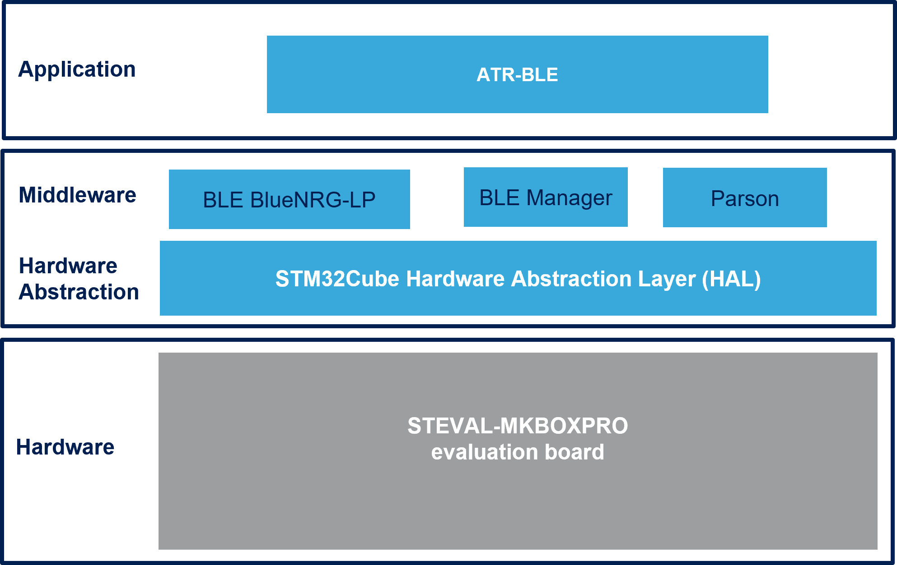

# FP-ATR-BLE1 Firmware Package

The FP-ATR-BLE1 is STM32Cube Function Pack for SensorTile.box PRO discovery box with multi-sensors and wireless connectivity (STEVAL-MKBOXPRO) 
The purpose of this functional pack is to provide simple asset tracking application for STEVAL-MKBOXPRO Pro that could be controlled by Bluetooth and NFC connectivity.

The expansion is built on STM32Cube software technology to ease portability across different STM32 microcontrollers.

**FP-ATR-BLE1 software features**:
- Complete example application to develop node with BLE&NFC connectivity, environmental and motion sensors, and perform real-time Tracking sensor monitor
- Firmware compatible with ST Asset Tracking applications for Android/iOS controlling and reading the tracking log
- Firmware compatible with ST BLE Sensor applications for Android/iOS for firmware update over the Air (FoTA)
- Easy portability across different MCU families, thanks to STM32Cube
- Free, user-friendly license terms

This firmware package includes Components Device Drivers, Board Support Package and example application for the:
  
- STMicroelectronics STEVAL-MKBOXPRO (SensorTile.box-Pro)  evaluation board that contains the following components:
  - MEMS sensor devices: STTS22H, LPS22DF, LSM6DSV16X, LIS2DU12, LIS2MDL
  - Dynamic NFC tag: ST25DV04K
  - Digital Microphone: MP23db01HP
  

Here is the list of references to user documents:

- [DB4147: STM32Cube function pack for asset tracking using BLE&NFC connectivity for SensorTile.box PRO discovery box with multi-sensors and wireless connectivity for any intelligent IoT node](https://www.st.com/resource/en/data_brief/fp-atr-ble1.pdf)
- [UM2626: Getting started with the FP-ATR-BLE1 STM32Cube function for asset tracking
using BLE connectivity for SensorTile.box Pro](https://www.st.com/en/embedded-software/fp-atr-ble1.html#documentation)
- [FP-ATR-BLE1 Quick Start Guide](https://www.st.com/en/embedded-software/fp-atr-ble1.html#documentation)

## Supported Devices and Boards

- STEVAL-MKBOXPRO (SensorTile.box PRO) discovery box with multi-sensors and wireless connectivity for any intelligent IoT node\[[STEVAL-MKBOXPRO](https://www.st.com/en/evaluation-tools/steval-mkboxpro.html)\]

## Known Limitations

## Development Toolchains and Compilers

-   IAR Embedded Workbench for ARM (EWARM) toolchain V9.20.1 + STLink/V3
-   RealView Microcontroller Development Kit (MDK-ARM) toolchain V5.37.0 + STLink/V3
-   Integrated Development Environment for STM32 (STM32CubeIDE) V1.13.2 + STLink/V3
	
## Dependencies 

This software release is compatible with:
- [**ST Asset Tracking Android application**](https://play.google.com/store/apps/details?id=com.st.assetTracking)  V3.4.0 (or higher)
- [**ST Asset Tracking iOS application**](https://apps.apple.com/it/app/st-asset-tracking/id1483734401)  V3.4.0 (or higher)
- [**ST BLE Sensor Android application**](https://play.google.com/store/apps/details?id=com.st.bluems)  V4.19.0 (or higher)
- [**ST BLE Sensor iOS application**](https://apps.apple.com/it/app/st-ble-sensor/id993670214)  V4.19.0 (or higher)
